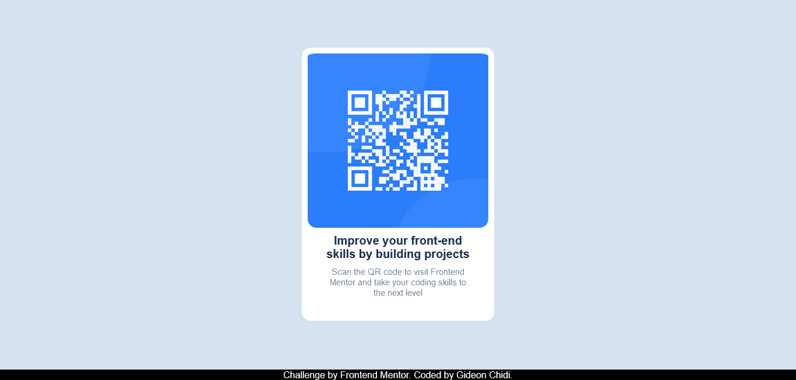

# Frontend Mentor - QR code component solution

This is a solution to the [QR code component challenge on Frontend Mentor](https://www.frontendmentor.io/challenges/qr-code-component-iux_sIO_H). Frontend Mentor challenges help you improve your coding skills by building realistic projects.

## Table of contents

- [Overview](#overview)
  - [Screenshot](#screenshot)
  - [Links](#links)
- [My process](#my-process)
  - [Built with](#built-with)
  - [What I learned](#what-i-learned)
  - [Continued development](#continued-development)
- [Author](#author)
- [Acknowledgments](#acknowledgments)

## Overview

### Screenshot



### Links

- Solution URL: (https://epic-snyder-3d6e3e.netlify.app/)

## My process

### Built with

- Semantic HTML5 markup
- CSS custom properties
- Flexbox

### What I learned

I learnt how to center component in the page. I was really frustrated by this but then i remembered flexbox and then decided first wrap the card itself in a div container.

```html
<div id="container">
  <div id="card">....</div>
</div>
```

I decided to give the container a position absolute and giving it the width and height of the body.Lastly i used flexxbox to center the card div to the page.

```css
#container {
  position: absolute;
  height: 100%;
  width: 100%;
  text-align: center;
  display: flex;
  flex-direction: column;
  justify-content: center;
  align-items: center;
  flex-wrap: wrap;
}
```

The rest just came naturally.

### Continued development

I really want to work on my css in order to make something close to a pixel perfect work.I am glad with this project. Personally i can say it is about 70% pixel perfect at the momment.I hope to get better and better in the not so far future.

## Author

-Author - Gideon Chidi

- Frontend Mentor - Gideon Chidi(https://www.frontendmentor.io/profile/gideon-del)

## Acknowledgments

This is where you can give a hat tip to anyone who helped you out on this project. Perhaps you worked in a team or got some inspiration from someone else's solution. This is the perfect place to give them some credit.
I really want to thank my mentor for giving me the encouragement i needed to finish this project. Without him i don't think i will be able to even start this project.Thanks a lot bro.
